# Data Visualization
Data Visualization course projects written in `Python`, based on library `Matplotlib` and `Plotly`. 

**Codes are in my private repository.** Feel free to reach out to me for access.

To save some space, I only list `representative` figures here. Please click the links below to see the full results for each project.

## Practice 2 - Histograms of binomial distributions (optional)
See full results for *[practice 2](markdowns/Project2.md)*. 

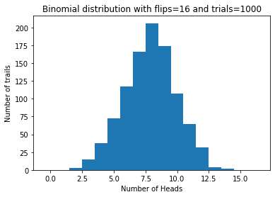 

## Project 3 - Stock market indices from CSV files
See full results for *[project 3](markdowns/Project3.md)*. 

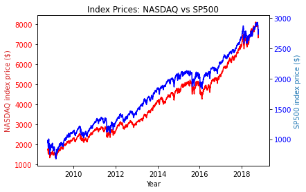 \
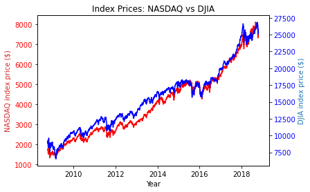 

## Project 4 - Orbital paths via differential eqs
See full results for *[project 4](markdowns/Project4.md)*. 

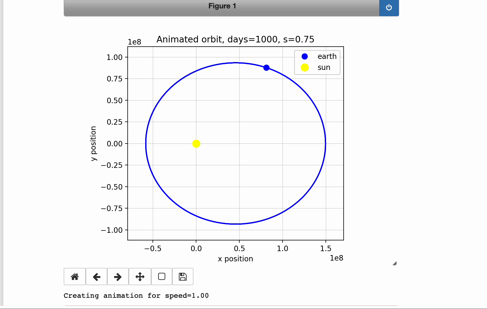 

## Project 5 - Images from dynamical systems
See full results for *[project 5](markdowns/Project5.md)*. 

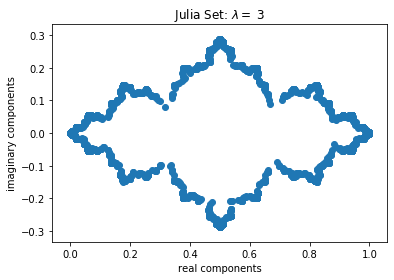 \
 \
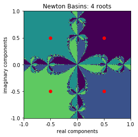 

## Project 6 - Arrangements for word clouds
See full results for *[project 6](markdowns/Project6.md)*. 

## Project 7 - Networks for social data
See full results for *[project 7](markdowns/Project7.md)*. 

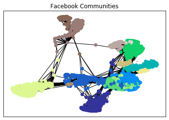 

## Project 8 - Geographic maps with overlays (part 1)
See full results for *[project 8](markdowns/Project8.md)*. 

 \

## Project 9 - Geographic maps with overlays (part 2)
See full results for *[project 9](markdowns/Project9.md)*. 

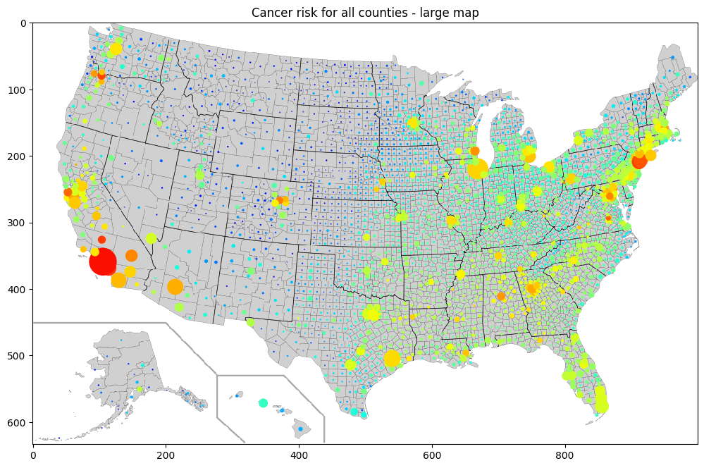 

## Project 10 - Spatial data clustering (part 1)
See full results for *[project 10](markdowns/Project10.md)*. 

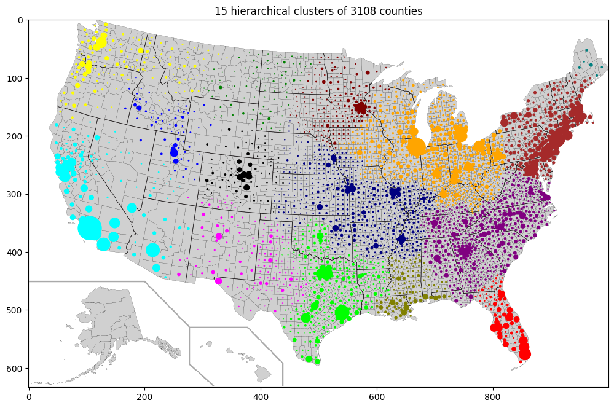

## Project 11 - Spatial data clustering (part 2)
See full results for *[project 11](markdowns/Project11.md)*. 

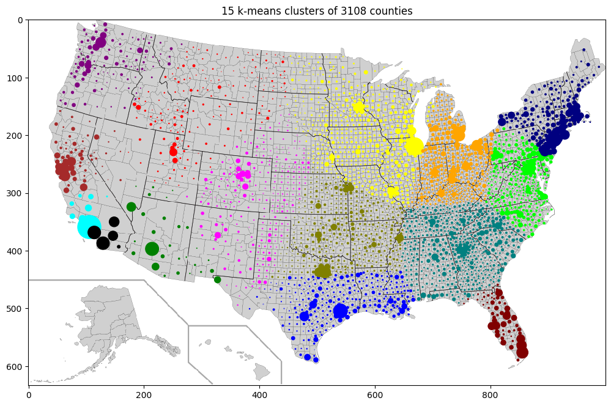 \
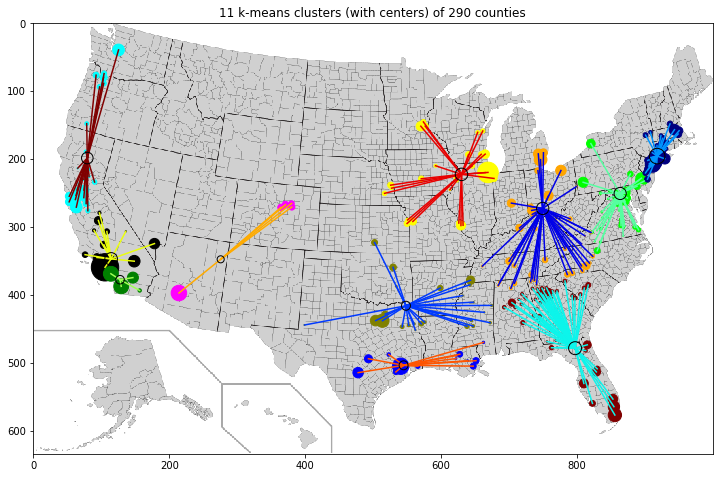 

## Project 12 - Digital elevation maps (part 1)
See full results for *[project 12](markdowns/Project12.md)*. 

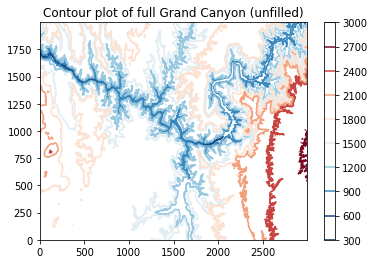 \
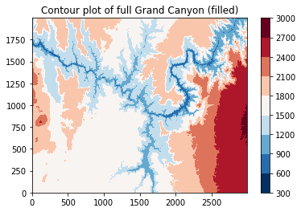 \
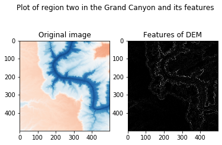 \
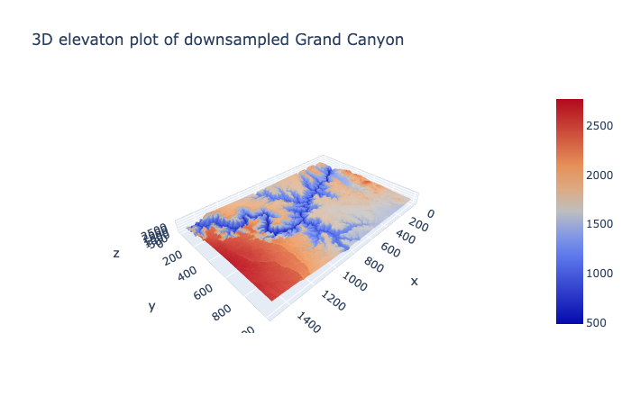 

## Project 13 - Digital elevation maps (part 2)
See full results for *[project 13](markdowns/Project13.md)*. 

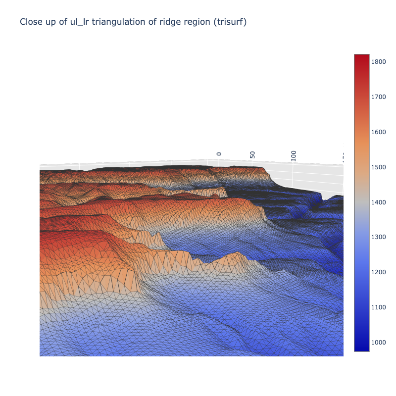 

## Project 14 - CT images