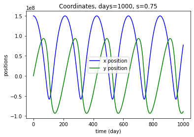

# Data Visualization
Data Visualization course projects written in `Python`, based on library `Matplotlib` and `Plotly`. **Codes are in my private repository.**

## Practice 2 - Histograms of binomial distributions (optional)
 \
 \
 

## Project 3 - Stock market indices from CSV files
 \
 \
 \
 \
 

## Project 4 - Orbital paths via differential eqs
 \
 \
 \
 \
 \
 \
 \
 \
 \
 \
 \
 
