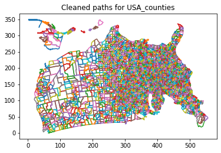
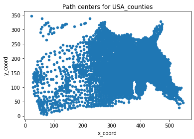

# Data Visualization
Data Visualization course projects written in `Python`, based on library `Matplotlib` and `Plotly`. **Codes are in my private repository.**

## Practice 2 - Histograms of binomial distributions (optional)
 

## Project 3 - Stock market indices from CSV files
 \
 

## Project 4 - Orbital paths via differential eqs
 

## Project 5 - Images from dynamical systems
 \
 \
 

## Project 6 - Arrangements for word clouds

## Project 7 - Networks for social data
 

## Project 8 - Geographic maps with overlays (part 1)
 \

## Project 9 - Geographic maps with overlays (part 2)
 

## Project 10 - Spatial data clustering (part 1)

## Project 11 - Spatial data clustering (part 2)
 \
 

## Project 12 - Digital elevation maps (part 1)
 \
 \
 \
 

## Project 13 - Digital elevation maps (part 2)
 

## Project 14 - CT images